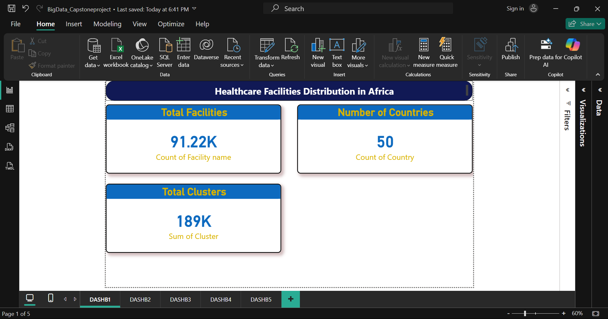
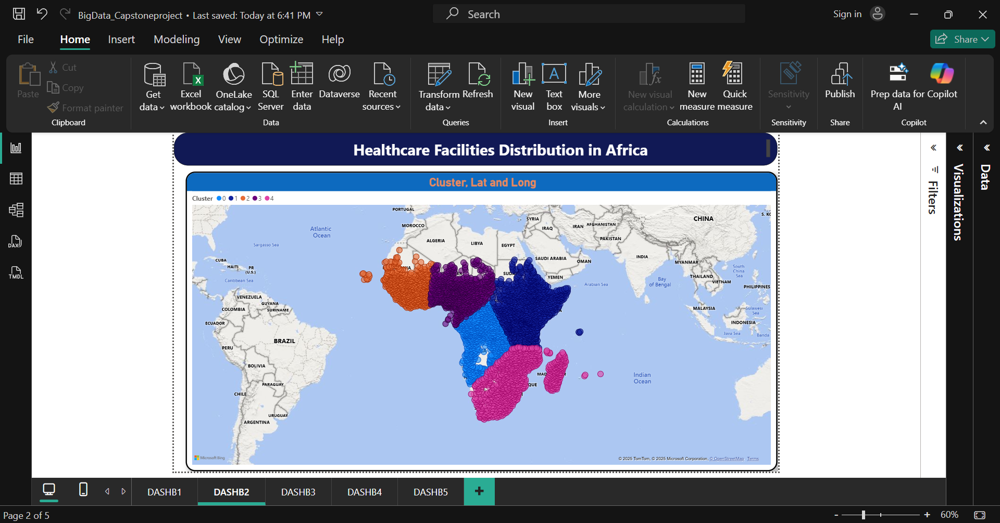
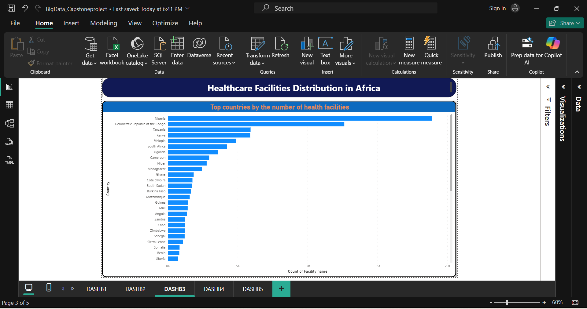
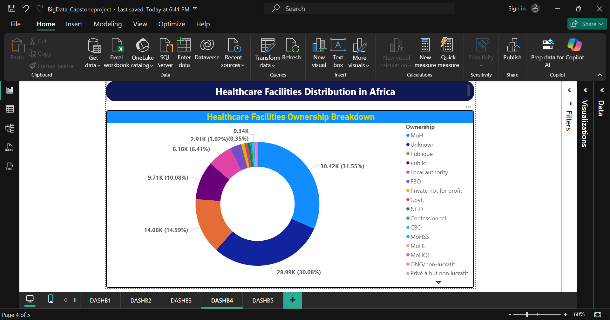
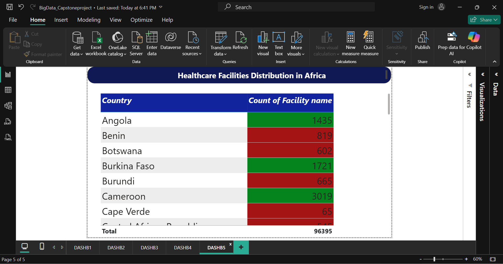

  <h1 style="color:#00A1DE;">Healthcare Facilities Distribution in Africa</h1>
  <h3><i>A Big Data Capstone Project by MUSHIMIRE Victor (ID: 27088)</i></h3>

---

### 
📘 Introduction

This project presents a comprehensive analysis of the distribution and characteristics of over **96,000 healthcare facilities** across the African continent. In many regions, access to quality healthcare is a critical challenge. Understanding the current landscape—where facilities are located, what types they are, and who owns them—is the first step toward identifying disparities and opportunities for improvement.

The goal of this analysis is to leverage data analytics and machine learning to transform raw data into actionable insights, visualized through an interactive Power BI dashboard. This project aims to answer key questions such as:
- Which countries have the highest and lowest density of health facilities?
- What are the most common types of facilities available?
- How does facility ownership vary across regions?
- Can we identify distinct geographical clusters of healthcare infrastructure?

---

### 
🔬 Methodology

The analysis followed a structured data analytics workflow, ensuring reproducibility and clarity from data acquisition to insight delivery.

- **Data Source**: The primary dataset was sourced from [Open Africa](https://open.africa/dataset/health-facilities-in-africa), providing a continent-wide inventory of health facilities.

- **Tools Used**:
  - `🐍 Python`: Core language for data processing.
    - `Pandas`: For data manipulation, cleaning, and exploratory data analysis (EDA).
    - `Matplotlib` & `Seaborn`: For generating static visualizations during the EDA phase.
    - `Scikit-learn`: For implementing the K-Means clustering algorithm.
  - `📊 Power BI`: The primary tool for creating the final interactive dashboard, performing visual analytics, and synthesizing insights.

- **Analytical Steps**:
  1.  **Data Loading and Preparation**: The initial dataset was loaded, assessed for quality, and cleaned to ensure accuracy.
  2.  **Exploratory Data Analysis (EDA)**: Descriptive statistics and initial visualizations were created to understand data distributions and relationships.
  3.  **Machine Learning Modeling**: K-Means clustering was applied to segment facilities into geographical groups based on their latitude and longitude.
  4.  **Dashboard Development**: An interactive dashboard was designed in Power BI to present the findings in an accessible and user-friendly manner.

---

### 
📊 Analysis Breakdown

<h4>1. Data Understanding and Preparation</h4>

***I. Dataset structure and dimensions***

***II. Initial data quality assessment (No missing values found)***

**N.B: The Python code for this stage can be found at `cleanses&transformation/dataPreparation.py`**

---

<h4>2. Exploratory Data Analysis (EDA)</h4>

***I. Generated descriptive statistics***

***II. Created visualizations showing distribution patterns***
*Geographical distribution across Africa and Top 20 countries by facility count.*

  
   

***III. Analyzed relationships between key variables***
*Heatmap of facility types by ownership, ownership distribution, and top 20 facility types.*

  
   
  

**N.B: The Python code for this stage can be found at `cleanses&transformation/EDA.py`**

---

<h4>3. 🤖 Machine Learning Model: K-Means Clustering </h4>

An unsupervised K-Means clustering model was used to identify natural geographical groupings of healthcare facilities. This helps to segment the continent into distinct zones based on infrastructure density.

***📈 Finding the Optimal Number of Clusters (k=5)***
The Elbow Method was used to find the optimal number of clusters, which was determined to be **5**. The Silhouette Score of **0.501** indicates that the clusters are reasonably well-defined and distinct.

  
   

***🛠️ Model Implementation***

**N.B: The Python code for this stage can be found at `cleanses&transformation/machineLearning.py`**

---

<h4>4. Data Analysis in Power BI</h4>

An interactive dashboard was created to synthesize all findings and allow for dynamic exploration of the data.

***I. Communicating Key Insights (KPIs and Geospatial Map)***

***II. Incorporating Interactivity (Slicers and Filters)***

---

### 
🏁 Results and Conclusion

The analysis yielded several key insights into the state of healthcare infrastructure in Africa:

- **Uneven Distribution**: There is a significant disparity in the number of health facilities among countries. **Nigeria** leads with nearly 20,000 facilities, while some nations have fewer than 100. This highlights a concentration of infrastructure in a few populous nations.
- **Dominance of Primary Care**: **Clinics, Dispensaries, and Health Centres** are the most common facility types. While this indicates a strong foundation for primary care, it also suggests a potential scarcity of specialized hospitals.
- **Public Sector Leadership**: The vast majority of facilities are publicly owned, primarily by the **Ministry of Health (MoH)**. This underscores the central role of government in healthcare provision across the continent.
- **Geographical Clustering**: The K-Means model successfully identified **five distinct geographical clusters**, roughly corresponding to West, Central, East, Southern, and North-Eastern Africa. These clusters can serve as a basis for region-specific health policy and resource allocation.

In conclusion, while Africa has a substantial number of primary healthcare facilities, their distribution is highly unequal. The reliance on public ownership suggests that government initiatives are crucial for any improvements. The Power BI dashboard effectively translates these complex datasets into an accessible tool for stakeholders to explore and understand these dynamics.

---

### 
💡 Recommendations and Future Work

Based on the analysis, the following actions are recommended:

- **Focus on Underserved Regions**: Policymakers should use the cluster analysis and country-level data to identify and prioritize investment in regions with low facility density.
- **Invest in Specialized Care**: Given the prevalence of primary care facilities, efforts should be made to develop more specialized and referral hospitals to handle complex medical needs.
- **Improve Data Collection**: A significant number of facilities had "Unknown" ownership. Improving data accuracy is crucial for effective planning and accountability.

For **future work**, this project could be expanded by:
- **Integrating Population Data**: Correlating facility locations with population density to calculate a "facilities per capita" metric for a more accurate measure of access.
- **Analyzing Facility Quality**: Incorporating data on staffing levels, equipment availability, or patient outcomes to assess the quality of care, not just the quantity of facilities.
- **Predictive Modeling**: Developing a model to predict ideal locations for new health facilities based on population needs, travel distance, and existing infrastructure.